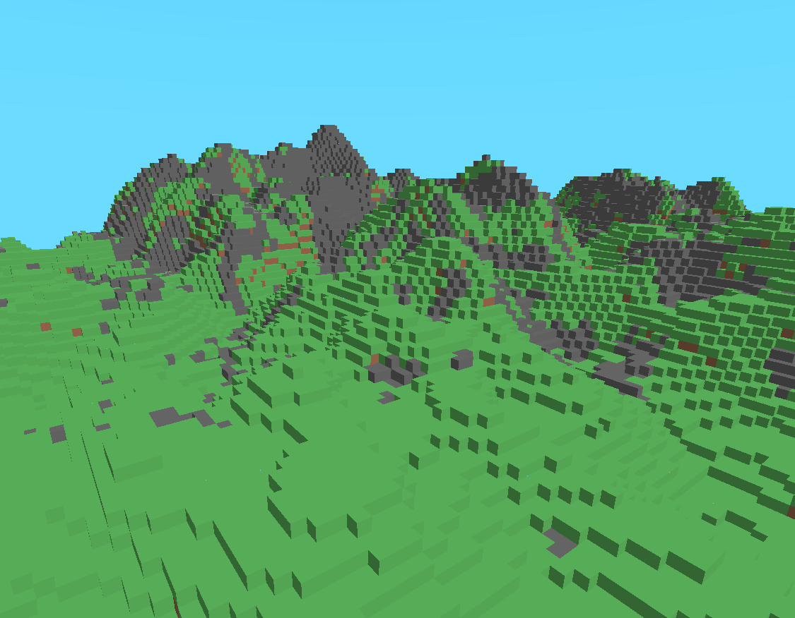
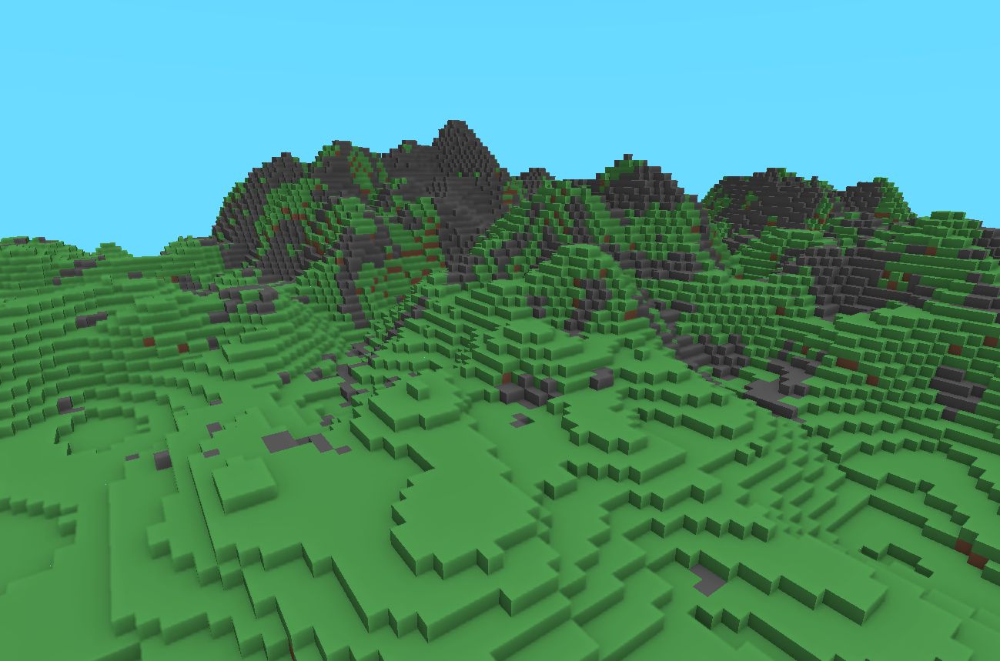

# SSAO-Shader
This repo was created to provide the files i used, to create the SSAO effect in my 3D Voxel Game from Youtube.
You can find a demonstration video <a href="https://www.youtube.com/watch?v=mnrTlqF9Tn0&lc=UgxHs49C2YfTaslMcSd4AaABAg.A2JGJNt0FmyA2XsnaJGeJT">here</a>!
I hope these files clear up some questions on how the shader and the stuff around it works. It took quite some time to get it to look right, so dont expect everything to work right away when you are implementing it yourself :).

## Without SSAO

With my awfull render engine I get around 400 FPS on average without the SSAO

## With SSAO

With SSAO turned on, I get 200 FPS
